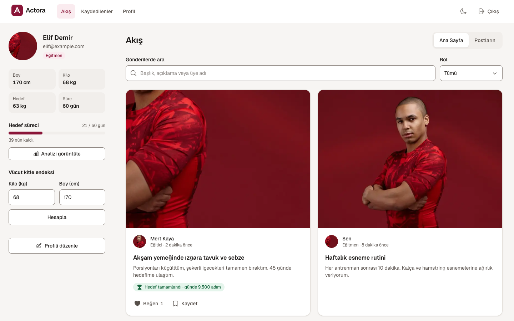
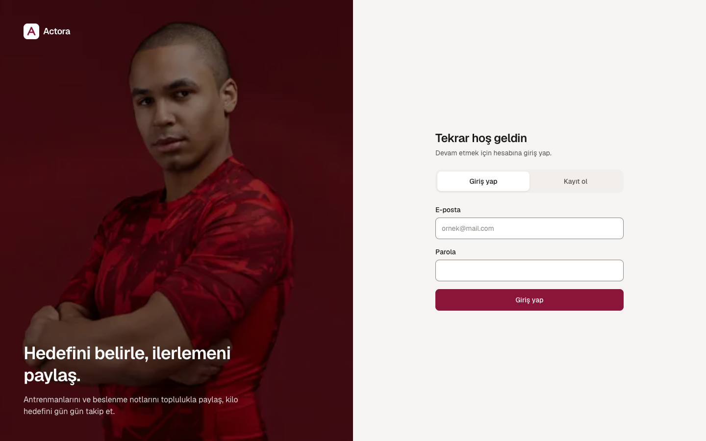
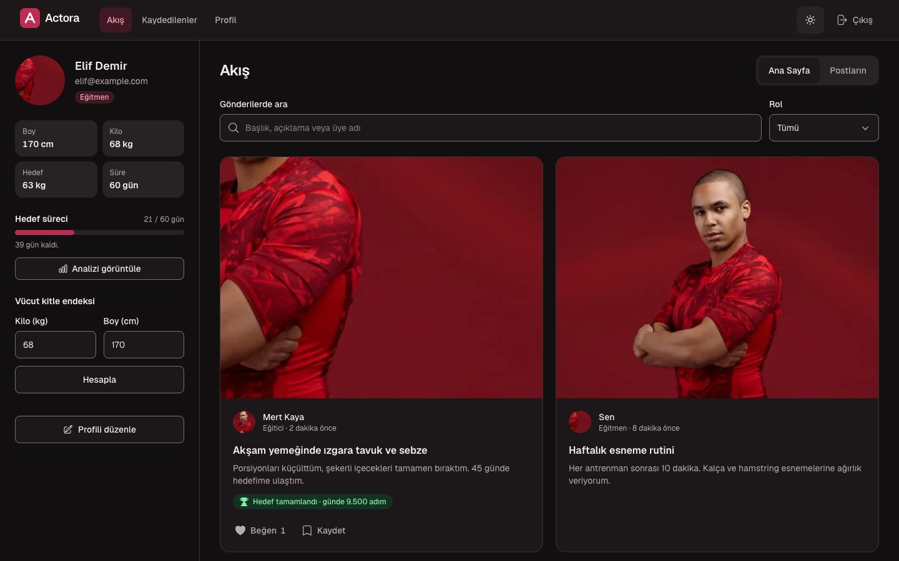
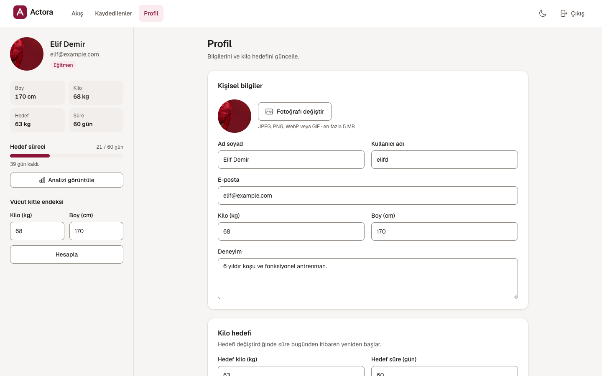
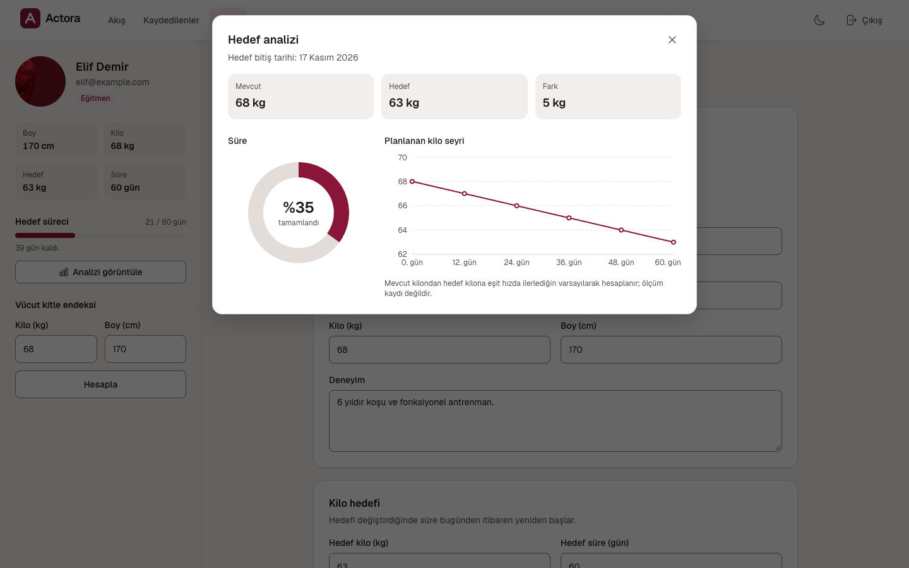
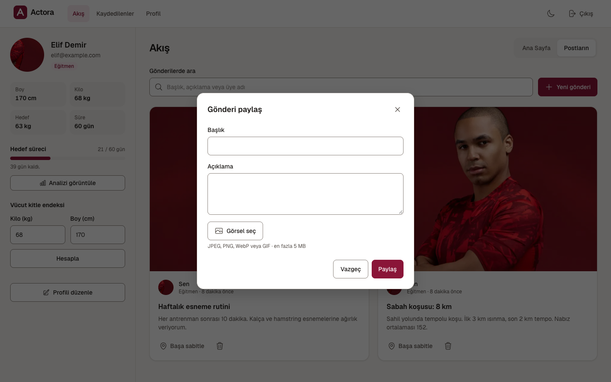
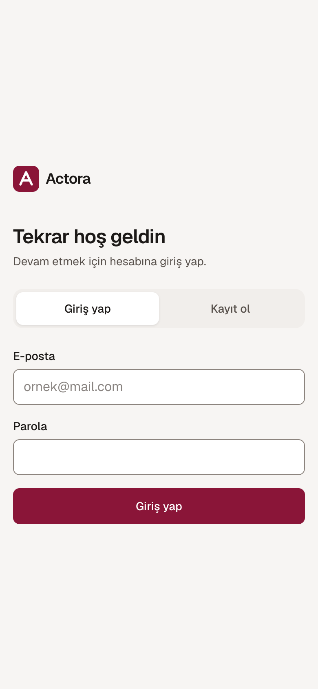
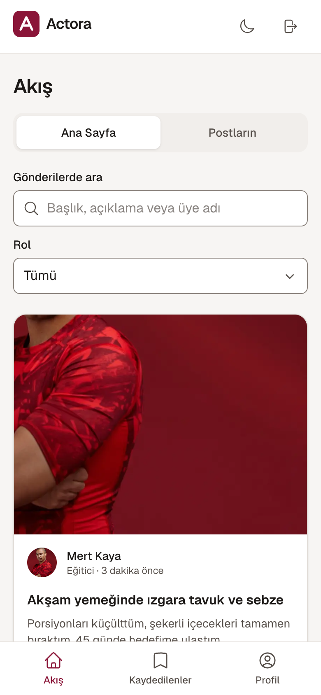
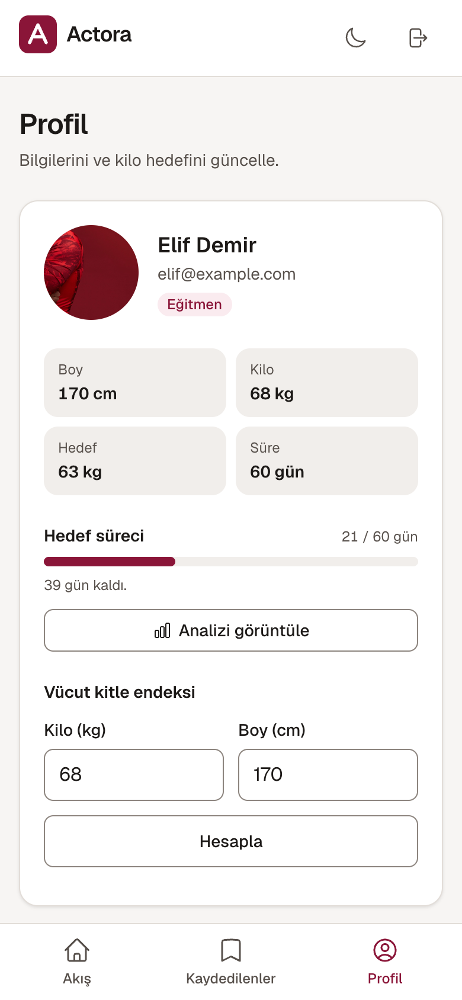
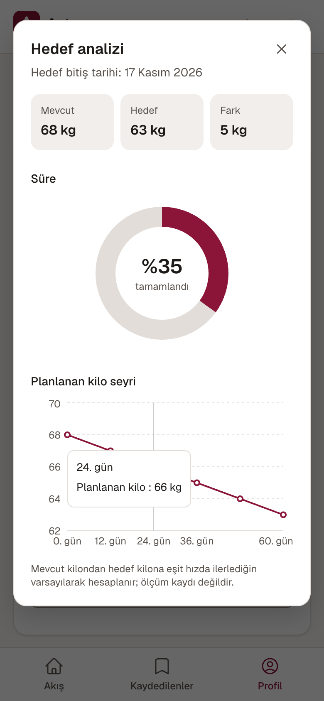

# Actora

Actora, bir fitness topluluğu web uygulamasıdır. Üyeler antrenman ve beslenme paylaşımları yapabilir, belirli bir tarihe yönelik kilo hedefleri belirleyebilir ve ilerlemelerini takip edebilir. Arayüz tamamen Türkçedir.



## Ne İşe Yarar?

Kilo hedeflerine ulaşmaya çalışan kişiler genellikle planlarını bir yerde, motivasyonlarını ise başka bir yerde tutar. Actora, kişisel hedefleri ve topluluk etkileşimini tek bir platformda birleştirir: geri sayım içeren kişisel bir hedef ve eğitmenlerin ve üyelerin yaptıkları çalışmaları paylaştığı bir akış.

Hedef süresi sona erdiğinde uygulama, üyeden sonucunu paylaşmasını veya hedefi sonlandırıp yeni bir hedef belirlemesini ister.

## Özellikler

- **Hesaplar** – `Eğitmen` veya `Eğitici` rolüyle kayıt olma, giriş yapma ve çıkış yapma.
- **Akış** – Fotoğraf, başlık ve açıklama içeren gönderiler; başlığa, açıklamaya veya yazara göre arama; role göre filtreleme ve gönderileri beğenme.
- **Gönderilerim** – Gönderi oluşturma, gönderileri listenin en üstüne sabitleme ve silme.
- **Kaydedilen gönderiler** – Akıştaki gönderileri yer imlerine ekleme. Kaydedilen gönderiler cihazda saklanır.
- **Profil** – Fotoğraf, kişisel bilgiler, kilo, boy, hedef kilo ve gün cinsinden hedef süresi.
- **Hedef takibi** – Hedef süresindeki ilerlemeyi gösteren bir ilerleme çubuğu ve geçen süreyi, mevcut kilodan hedef kiloya uzanan planlanan kilo değişimini gösteren bir analiz penceresi.
- **Hedef tamamlama** – Hedef süresi sona erdiğinde sonucu gönderi olarak paylaşma (beslenme ve günlük adım sayısı gibi bilgilerle) veya paylaşımı atlama.
- **Vücut kitle indeksi (BMI) hesaplayıcısı** – `Eğitmen` rolüne sahip kullanıcılar tarafından kullanılabilir.
- **Hesap kontrolleri** – Hesabı dondurma veya hesabı silme.
- **Açık ve koyu temalar** – Sistem tercihini takip eder ve kullanıcının manuel tema seçimini hatırlar.

## Ekran Görüntüleri

Tüm görseller, demo verileriyle çalışan uygulamadan alınmıştır.

| Giriş | Akış (koyu tema) |
| --- | --- |
|  |  |

| Profil | Hedef analizi |
| --- | --- |
|  |  |

| Yeni gönderi |
| --- |
|  |

### Mobil Görünüm (390 px)

| Giriş | Akış | Profil | Hedef analizi |
| --- | --- | --- | --- |
|  |  |  |  |

## Teknoloji Yığını

| Teknoloji | Kullanım amacı |
| --- | --- |
| Next.js 15 (App Router) | Sayfa yönlendirme, render işlemleri ve görsel optimizasyonu |
| React 19 | Bileşen tabanlı kullanıcı arayüzü |
| Tailwind CSS 3 | Tasarım değişkenleriyle stil yönetimi |
| TanStack Query | Önbellekleme ve veri işlemlerinin yönetimi |
| Axios | HTTP istekleri |
| Recharts | Hedef analizi grafikleri |
| Heroicons | İkonlar |
| ESLint | Kod kalitesi ve statik analiz |
| Vitest | Birim testleri |

## Frontend Mimarisi

```text
frontend/
  src/
    app/
      (app)/                Oturum açmış kullanıcılara ait sayfalar
                            (akış, kaydedilen gönderiler, profil)
      components/           Uygulama rotaları ve sayfa yapıları
      globals.css           Global stiller ve tasarım değişkenleri
      layout.js             Kök yerleşim
    components/
      ui/                   Paylaşılan UI bileşenleri:
                            Button, Field, Dialog, Tabs, Toast vb.
      layout/               Uygulama kabuğu, başlık, mobil gezinme,
                            tema değiştirme
    features/
      auth/                 Kimlik doğrulama arayüzü ve işlemleri
      posts/                Gönderi özellikleri
      profile/              Profil ve hedef yönetimi
    lib/                    Yardımcı fonksiyonlar,
                            biçimlendirme ve medya işlemleri
  tests/                    Birim testleri
```

### Mimari Yaklaşım

- **Özellik bazlı organizasyon:** Kimlik doğrulama, gönderiler ve profil gibi işlevler ayrı modüllerde tutulur.
- **Paylaşılan UI bileşenleri:** Tekrar kullanılabilir arayüz bileşenleri ortak bir yapıda düzenlenir.
- **Tasarım değişkenleri:** Renkler `frontend/src/app/globals.css` dosyasındaki CSS değişkenleriyle yönetilir ve Tailwind'e aktarılır. Açık ve koyu temalar aynı değişken yapısını kullanır.
- **Bileşenlerden ayrılmış iş mantığı:** BMI hesaplama, hedef ilerlemesi, gönderileri sabitleme, arama ve doğrulama gibi işlemler ayrı fonksiyonlarla yönetilir ve birim testleriyle doğrulanabilir.
- **Erişilebilir diyaloglar:** Yerel HTML `dialog` öğesi odak yönetimi ve Escape tuşuyla kapatma gibi özellikler sağlar.

## Kurulum ve Başlangıç

**Gereksinimler:** Node.js 20 veya üzeri.

```bash
cd frontend
npm install
cp .env.example .env.local
```

`.env.local` dosyasındaki `NEXT_PUBLIC_BASE_PATH` değişkenini uygulamanın kullandığı servis adresine göre yapılandırın.

Geliştirme sunucusunu başlatmak için:

```bash
npm run dev
```

Tarayıcıdan `http://localhost:3000` adresini açın.

## Kullanılabilir Komutlar

| Komut | Açıklama |
| --- | --- |
| `npm run dev` | Geliştirme sunucusunu başlatır |
| `npm run build` | Üretim derlemesini oluşturur |
| `npm run start` | Üretim sunucusunu başlatır |
| `npm run lint` | ESLint kod denetimini çalıştırır |
| `npm test` | Birim testlerini çalıştırır |

## Testler

```bash
npm run lint
npm test
npm run build
```

Birim testleri şu alanları kapsar:

- Girdi doğrulama
- BMI ve hedef hesaplamaları
- Gönderileri sabitleme
- Arama
- Medya URL'lerinin işlenmesi
- Hata mesajları

Projede henüz otomatik bileşen testleri veya uçtan uca (E2E) testler bulunmamaktadır.

## Güvenlik, Erişilebilirlik ve Performans

- Formlarda etiketlenmiş yerel HTML kontrolleri ve alan içi hata mesajları kullanılır.
- Diyaloglarda odak yönetimi sağlanır.
- Dokunmatik ekranlardaki etkileşim alanları en az 44 px olacak şekilde tasarlanmıştır.
- Klavye kullanıcıları için atlama bağlantısı bulunur.
- Azaltılmış hareket tercihleri dikkate alınır.
- Grafik kütüphanesi yalnızca hedef analizi penceresi açıldığında yüklenir.
- Gönderi görselleri `next/image` üzerinden işlenir ve sabit en-boy oranlarıyla düzen kaymaları azaltılır.
- Kaydedilen gönderiler ve tema tercihi cihazda saklanır.

## Bilinen Sınırlamalar

- Oturum bilgisi `localStorage` içinde tutulduğu için olası XSS açıklarında enjekte edilen betikler tarafından okunabilir.
- Web istemcisi için ayrıca bir Content-Security-Policy (CSP) tanımlanmamıştır.
- Akış, sayfalama olmadan en son 200 gönderiyi getirir.
- Kaydedilen ve sabitlenen gönderiler cihazlar arasında senkronize edilmez.
- Kaydedilen gönderiler anlık görüntü olarak saklandığı için orijinal gönderi değiştiğinde otomatik olarak güncellenmez.
- Parola sıfırlama, e-posta doğrulama, gönderi düzenleme arayüzü ve yorum yapma özellikleri bulunmamaktadır.
- `npm audit` çalıştırıldığında web istemcisinin derleme araçlarıyla ilgili bazı güvenlik uyarıları görülebilir.
